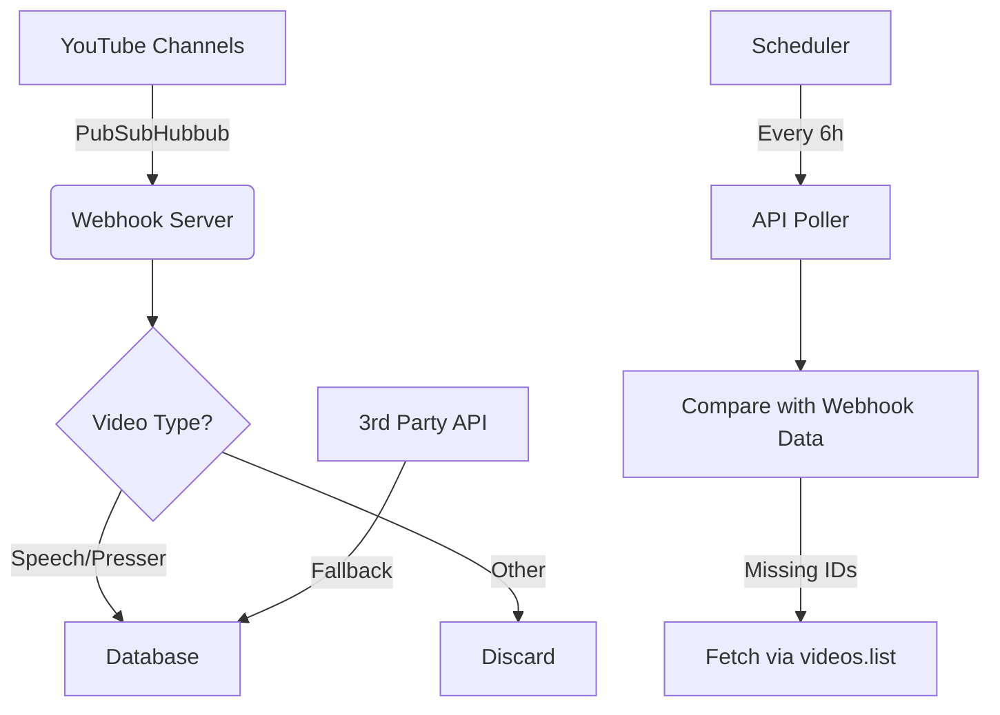

# Comprehensive Strategy for Monitoring YouTube Channels and Content Discovery  

## I. Core Monitoring Architecture: Webhooks + Scheduled Validation  

### 1. **Primary Method: PubSubHubbub Webhooks**  
**Implementation:**  
- **Channel Subscription:** Use the `https://www.youtube.com/feeds/videos.xml?channel_id=CHANNEL_ID` endpoint for each monitored channel[1][4].  
- **Callback Server:** Deploy a scalable endpoint (e.g., AWS Lambda/Cloudflare Worker) to handle verification challenges (`hub.challenge` response)[2][16] and parse Atom feed notifications containing `<yt:videoId>` and `<yt:channelId>`[4][10].  

**Scalability Considerations:**  
- **Batching:** Process notifications in bulk every 5-10 seconds to handle spikes during live events or rapid channel updates.  
- **Retry Logic:** Implement exponential backoff for failed notifications (YouTube may resend updates for 24h)[16].  

---

### 2. **Fallback: Scheduled API Polling**  
**Use Case:** Detect missed webhook notifications or validate channel activity.  
**Configuration:**  
```python  
# Example: Check for new videos every 6 hours  
from googleapiclient.discovery import build  

def poll_channel(youtube, channel_id):  
    response = youtube.search().list(  
        part="snippet",  
        channelId=channel_id,  
        order="date",  
        maxResults=5,  # Minimizes quota usage (5 * 100 = 500 units)  
        type="video"  
    ).execute()  
    return response["items"]  
```
**Quota Impact:** 100 units per `search.list` call + 1 unit per `videos.list` metadata check[8][15].  

---

## II. Content Discovery Beyond Subscribed Channels  

### 1. **Periodic Keyword Searches**  
**Strategy:**  
- Target niche keywords (e.g., "Trump rally live stream") with `search.list(q=KEYWORD, type=video, videoDuration=long)`[8].  
- Use `publishedAfter` parameter to avoid redundant checks[9].  

**Optimization:**  
- **Caching:** Store video IDs for 48h to prevent duplicate processing.  
- **Geofiltering:** `regionCode=US` parameter for location-specific content[9].  

### 2. **Alternative Account-Based Monitoring**  
**TOS-Compliant Approach:**  
- Create separate YouTube accounts for each monitored topic (e.g., @TrumpSpeechesArchive).  
- Leverage YouTube’s "Notify when channel posts" bell icon to receive platform-native alerts, then scrape via authenticated API[19].  

---

## III. Quota and Compliance Safeguards  

### 1. **Quota Management**  
| Technique                          | Quota Impact Reduction |  
|------------------------------------|------------------------|  
| Webhook-driven updates             | 0 units (non-API path) |  
| `videos.list` instead of `search`  | 1 vs. 100 units[15]   |  
| Batch video metadata requests       | 1 unit per 50 IDs[15] |  

**Emergency Measures:**  
- Deploy multiple Google Cloud projects with independent 10k quotas[14][18].  
- Third-party services like Phyllo (3rd party API) for auxiliary data[12].  

### 2. **TOS Compliance Checklist**  
- Avoid automating user interactions (e.g., mass subscriptions via API).  
- Store raw video IDs instead of full metadata to comply with data retention rules[18].  
- Obfuscate politically sensitive keywords in search queries to avoid triggering anti-bot systems.  

---

## IV. Example Architecture  



## V. Critical Tools and Libraries  
- **Webhook Handling:** `youtube-notification` Node.js library[17]  
- **Quota Monitoring:** Google Cloud’s Operations Suite with custom metrics[5][11]  
- **Compliance:** Automated TOS review via OpenAI moderation endpoint  

**Note:** Always include `User-Agent: political-research-bot/1.0` in headers to avoid misclassification as scrapers[20].

Sources
[1] Subscribe to Push Notifications | YouTube Data API https://developers.google.com/youtube/v3/guides/push_notifications
[2] WebSub to EventGrid via CloudEvents, and Beyond https://techcommunity.microsoft.com/blog/appsonazureblog/websub-to-eventgrid-via-cloudevents-and-beyond/2092709
[3] YouTube Data API (v3) supports push notifications via PubSubHubbub https://cercledelarbalete.org/youtube-data-api-v3-supports-push-notifications-via-pubsubhubbub/
[4] Subscribe to Push Notifications | YouTube Data API | Google for Developers https://developers.google.com/youtube/v3/guides/push_notifications
[5] Quota and Compliance Audits | YouTube Data API https://developers.google.com/youtube/v3/guides/quota_and_compliance_audits
[6] Google decreased youtube api v3 limits for queries per day to 10 ... https://stackoverflow.com/questions/54548999/google-decreased-youtube-api-v3-limits-for-queries-per-day-to-10-000-per-day-for
[7] Isnt there any option in Youtube Api to get live poll data and result ... https://stackoverflow.com/questions/78460499/isnt-there-any-option-in-youtube-api-to-get-live-poll-data-and-result-for-live-s
[8] Search: list | YouTube Data API - Google for Developers https://developers.google.com/youtube/v3/docs/search/list
[9] Activities: list | YouTube Data API - Google for Developers https://developers.google.com/youtube/v3/docs/activities/list
[10] YouTube API webhooks - PubSubHubbub a.k.a. WebSub with Rails https://www.youtube.com/watch?v=QQSJGS2JR4w
[11] Quota Calculator | YouTube Data API - Google for Developers https://developers.google.com/youtube/v3/determine_quota_cost
[12] Youtube API limits : How to calculate API usage cost and fix ... - Phyllo https://www.getphyllo.com/post/youtube-api-limits-how-to-calculate-api-usage-cost-and-fix-exceeded-api-quota
[13] What is PubSubHubbub? - YouTube https://www.youtube.com/watch?v=B5kHx0rGkec
[14] Please explain the YouTube Data API's Quota / Limits - Stack Overflow https://stackoverflow.com/questions/77551759/please-explain-the-youtube-data-apis-quota-limits
[15] Further explanations on YouTube API quota: eg. does `search ... https://stackoverflow.com/questions/71621845/further-explanations-on-youtube-api-quota-eg-does-searchmaxresults-add-up
[16] AlgoDame/Youtube-PubSubHubBub-Notification-Application - GitHub https://github.com/AlgoDame/Youtube-PubSubHubBub-Notification-Application
[17] How to Subscribe to and Receive Push Notifications from YouTube's ... https://dev.to/algodame/how-to-subscribe-to-and-receive-push-notifications-from-youtubes-api-using-typescript-and-nodejs-2gik
[18] Understanding YouTube API Quota Limits - GitHub https://github.com/ThioJoe/YT-Spammer-Purge/wiki/Understanding-YouTube-API-Quota-Limits
[19] Use Youtube Pubsubhubbub for real-time youtube updates - idea https://forum.newsblur.com/t/use-youtube-pubsubhubbub-for-real-time-youtube-updates/10894
[20] YouTube Data API (v3): limits, operations, resources, methods etc. in ... https://elfsight.com/blog/youtube-data-api-v3-limits-operations-resources-methods-etc/
[21] Unlock the Power of Open Integration with Websub & Spring Boot https://www.youtube.com/watch?v=JYdM3ICU6XE
[22] YouTube API Essential Guide - Rollout https://rollout.com/integration-guides/youtube/api-essentials
[23] Google Cloud PubSubHubbub and notifications, part 1 ... - YouTube https://www.youtube.com/watch?v=Nl9ECavrAZ0
[24] YouTube's Wonky WebSub - Kevin Cox https://kevincox.ca/2021/12/16/youtube-websub/
[25] Notified when Youtube video is uploaded API - Stack Overflow https://stackoverflow.com/questions/43118114/notified-when-youtube-video-is-uploaded-api
[26] YouTube Push Notifications via Webhooks & PubSubHubbub ... https://stackoverflow.com/questions/67277568/youtube-push-notifications-via-webhooks-pubsubhubbub-python3-returning-200-o
[27] Does youtube pubsubhub feed send an auto renew request or do ... https://www.reddit.com/r/rss/comments/17p3nt1/does_youtube_pubsubhub_feed_send_an_auto_renew/
[28] Google I/O 2013 - YouTube API Push Notifications https://www.youtube.com/watch?v=NlZZghBnfdM
[29] pubsubhubbub: subscribe OK, not receiving POST updates for YT ... https://issuetracker.google.com/issues/204101548
[30] devrel-kr/youtube-websub-subscription-handler - GitHub https://github.com/devrel-kr/youtube-websub-subscription-handler
[31] Sample API Requests | YouTube Data API - Google for Developers https://developers.google.com/youtube/v3/sample_requests
[32] Google Cloud PubSubHubbub and notifications, part 2 ... - YouTube https://www.youtube.com/watch?v=DscuyFCt0q8
[33] YouTube API Services - Developer Policies https://developers.google.com/youtube/terms/developer-policies
[34] Intro to YouTube API and Cost-Based Quota: Everything You Need ... https://www.youtube.com/watch?v=MHUGuw1Agnc
[35] Rate Limiting | Service Infrastructure Documentation - Google Cloud https://cloud.google.com/service-infrastructure/docs/rate-limiting
[36] How to Poll APIs in Make.com (Step-by-Step Guide!) - YouTube https://www.youtube.com/watch?v=-JDb190rRvc
[37] Does the YouTube node use too much Google API quota? - Questions https://community.n8n.io/t/does-the-youtube-node-use-too-much-google-api-quota/33320
[38] Did you ever increased your daily YouTube API quota? - Reddit https://www.reddit.com/r/googlecloud/comments/1ez5ugd/did_you_ever_increased_your_daily_youtube_api/
[39] What is best practice for polling continuous data from api? - Reddit https://www.reddit.com/r/sveltejs/comments/1i7yen5/what_is_best_practice_for_polling_continuous_data/
[40] Has anyone increased their YouTube Data V3 API quota before ... https://www.reddit.com/r/googlecloud/comments/1bnxsd6/has_anyone_increased_their_youtube_data_v3_api/
[41] Optimize Meraki APIs: Rate Limiting & Best Practices - YouTube https://www.youtube.com/watch?v=RiT54q0Qmt0
[42] Here's how Polling can help you with long-running tasks - YouTube https://www.youtube.com/watch?v=DBU36FbPojI&vl=en
[43] YouTube API Services - Audit and Quota Extension Form https://support.google.com/youtube/contact/yt_api_form
[44] Quota Calculator | YouTube Data API - Google for Developers https://developers.google.com/youtube/v3/determine_quota_cost
[45] YouTube Data API V3 - Maximum search result for Channel ID https://stackoverflow.com/questions/64709715/youtube-data-api-v3-maximum-search-result-for-channel-id
[46] Channels: list | YouTube Data API - Google for Developers https://developers.google.com/youtube/v3/docs/channels/list
[47] I just started playing with YOUTUBE API and i"ve already exceeded ... https://www.reddit.com/r/webdev/comments/15i2mdm/i_just_started_playing_with_youtube_api_and_ive/
[48] Videos: list | YouTube Data API - Google for Developers https://developers.google.com/youtube/v3/docs/videos/list
[49] API Guide — youtube-data-api 0.0.17 documentation https://youtube-data-api.readthedocs.io/en/latest/youtube_api.html
[50] YouTube Data API Overview | How to Implement it in Your Applications https://apidog.com/blog/youtube-api/
[51] Determine a YouTube channel's upload rate using YouTube Data ... https://stackoverflow.com/questions/64123167/determine-a-youtube-channels-upload-rate-using-youtube-data-api-v3
[52] Faceless YouTube Channel Guide | Metricool https://metricool.com/faceless-youtube-channel/
[53] Generating a YouTube API key · kieraneglin/pinchflat Wiki - GitHub https://github.com/kieraneglin/pinchflat/wiki/Generating-a-YouTube-API-key
[54] WebSub – A deep dive - Ably Realtime https://ably.com/topic/websub
[55] Subscribe to Push Notifications | YouTube Data API https://developers.google.com/youtube/v3/guides/push_notifications
[56] YouTube Best Practices | Brand Communications Guide https://communicationsguide.ucdavis.edu/departments/social-media/platform-best-practices/youtube-best-practices
[57] Websub Review: Revolutionize Your WordPress Interactions https://macroter.com/websub-review-publish-subscribe-for-wordpress/
[58] How is my app notified with Webhooks?Do I need to poll the ... https://stackoverflow.com/questions/52654218/how-is-my-app-notified-with-webhooksdo-i-need-to-poll-the-recipient-url
[59] 7 Ways to Grow your YouTube Channel | CO https://www.uschamber.com/co/grow/marketing/youtube-channel-best-practices
[60] Create and Publish a WebSub/WebHook API https://apim.docs.wso2.com/en/4.4.0/tutorials/streaming-api/create-and-publish-websub-api/
[61] HTTP Polling vs SSE vs WebSocket vs WebHooks - YouTube https://www.youtube.com/watch?v=JQoPuXAf92U
[62] Common App Activities List & Honors | #1 Guide & Examples https://www.commandeducation.com/resource/common-app-activities-list/
[63] How to Arrange Your Activities List on the Common App https://www.crimsoneducation.org/za/blog/how-to-arrange-your-activities-list-on-the-common-app/
[64] How do I find old polls I voted on? : r/youtube - Reddit https://www.reddit.com/r/youtube/comments/15anw10/how_do_i_find_old_polls_i_voted_on/
[65] How to Write a Successful Common App Activities List in 2024 https://www.collegeessayguy.com/blog/guide-college-activities-list-common-app-example-application
[66] Live polls, wordclouds, spinner wheels & more for YouTube ... https://www.streamalive.com/solutions/youtube-live
[67] Top Tips to Craft a Standout Common App Activities List https://www.crimsoneducation.org/us/blog/how-to-ace-the-common-app-activities-list/
[68] Report on YouTube & partners line items - Display & Video 360 Help https://support.google.com/displayvideo/answer/6274610
[69] YouTube Data API (v3): limits, operations, resources, methods etc. in ... https://elfsight.com/blog/youtube-data-api-v3-limits-operations-resources-methods-etc/
[70] YouTube Data API Tutorial - Search for Videos https://www.youtube.com/watch?v=QY8dhl1EQfI
[71] YouTube Data API - Scipress https://www.scipress.io/post/jBCHKfSChrZWch9DFSwa/YouTube-Data-API
[72] What is the quota cost and id limit for listing videos via YouTube ... https://stackoverflow.com/questions/71275104/what-is-the-quota-cost-and-id-limit-for-listing-videos-via-youtube-data-api
[73] Youtube Data API v3 & jQuery To List Channel Videos https://www.youtube.com/watch?v=jdqsiFw74Jk
[74] Youtube data v3 api cost in dollars - Stack Overflow https://stackoverflow.com/questions/75864505/youtube-data-v3-api-cost-in-dollars
[75] Introducing Youtube Monitoring, and best practices for Google ... https://community.marfeel.com/t/introducing-youtube-monitoring-and-best-practices-for-google-discover/78150
[76] Optimize Your YouTube Channel For 2023: Best Practices https://www.dailyrindblog.com/optimize-your-youtube-channel-for-2023-best-practices/
[77] How to Monitor Your YouTube Channel https://www.youtube.com/watch?v=ZNthNDYIotE
[78] Video Content Creation Strategy, Tips & Tools - YouTube Creators https://www.youtube.com/intl/en_us/creators/how-things-work/content-creation-strategy/
[79] Social Media Monitoring on YouTube: A Comprehensive Guide https://www.aimtechnologies.co/social-media-monitoring-on-youtube-a-comprehensive-guide/
[80] What's the hubbub about WebSub? - LinkedIn https://www.linkedin.com/pulse/whats-hubbub-websub-joseph-wortmann
[81] Add Video to Youtube Playlist (Webhook) - Make Community https://community.make.com/t/add-video-to-youtube-playlist-webhook/44727
[82] Youtube API limits : How to calculate API usage cost and fix ... - Phyllo https://www.getphyllo.com/post/youtube-api-limits-how-to-calculate-api-usage-cost-and-fix-exceeded-api-quota
[83] how to make ur activities list go so crazy (REUPLOAD) - Reddit https://www.reddit.com/r/ApplyingToCollege/comments/170r6th/how_to_make_ur_activities_list_go_so_crazy/
[84] Track YouTube Poll Results in Linear - DryMerge https://drymerge.com/use-case/track-youtube-poll-results-in-linear-linear-youtube
